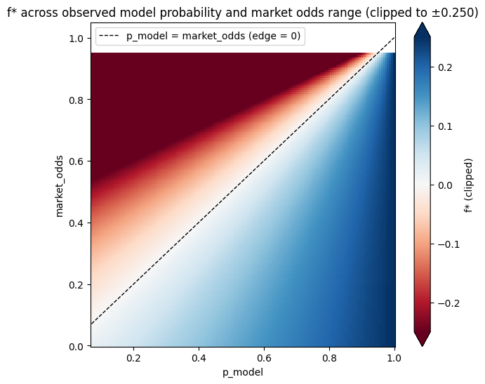
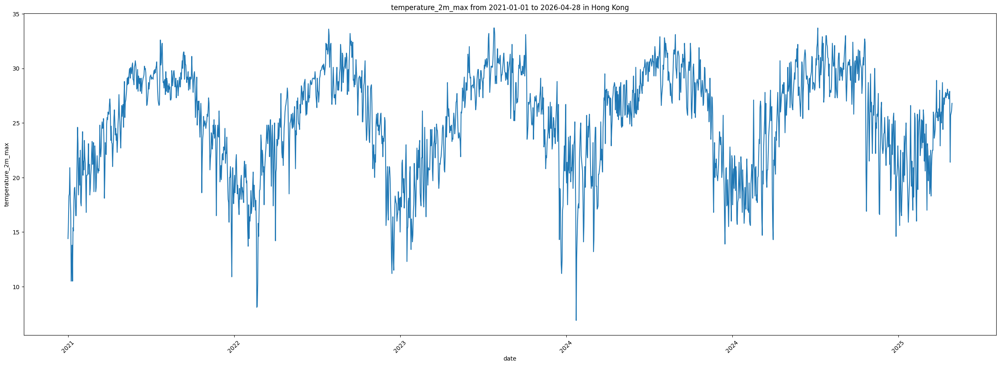
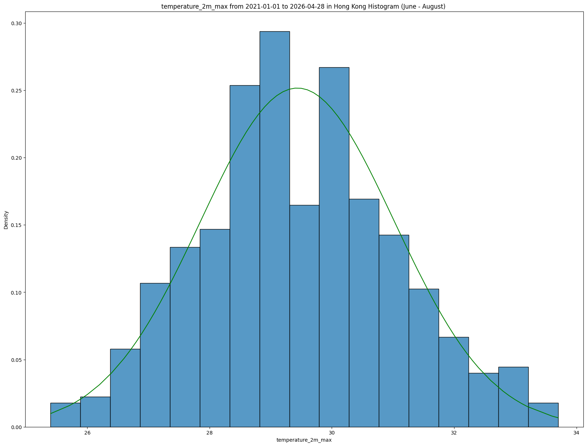
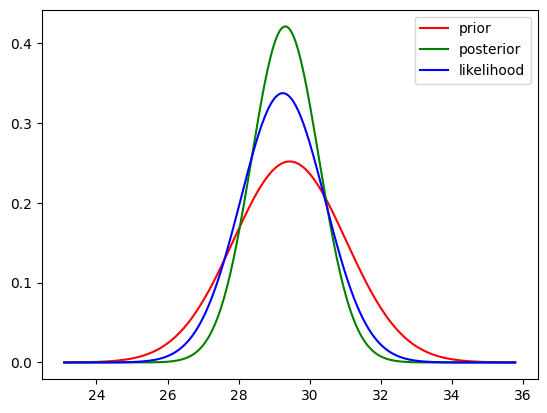
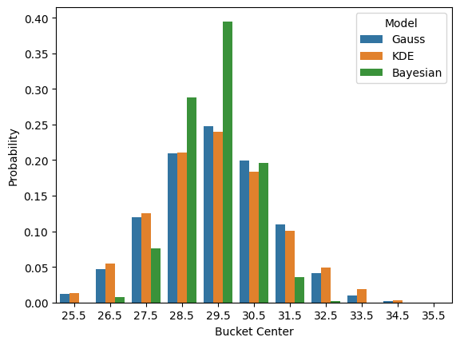
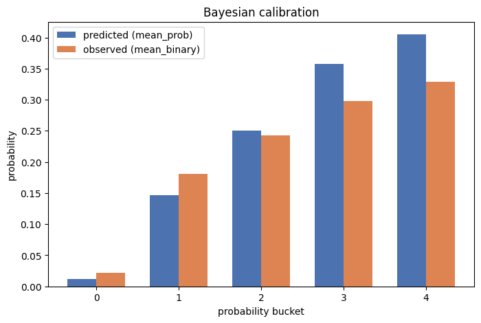
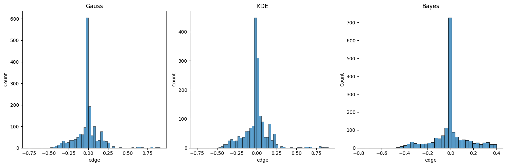

# Quant Summer Project

A probabilistic decision making and pricing research platform, not a trading bot. It builds calibrated probability distributions over a real world weather event (daily max temperature in Hong Kong), compares those model implied probabilities against Polymarket's market implied prices, and evaluates whether the resulting mispricing survives risk adjusted position sizing and transaction costs.

The goal is **probabilistic accuracy and risk adjusted decision quality**, not raw P&L. Every result in this repo should be read with that in mind.



*Fractional Kelly stake f\* across the observed range of model probability and market odds. Blue is a Yes bet, red is a No bet, the dashed line is zero edge. From `notebooks/08_Risk_Analysis_Kelly.ipynb`.*

## What it does

1. **Ingests data.** Historical + forecast temperature data (Open-Meteo) and resolved prediction market data (Polymarket).
2. **Builds probability models.** Three independent estimators of P(temperature in bucket) are used, namely a Gaussian baseline, a KDE model, and a Bayesian model that updates a climatological prior with the day's specific forecast.
3. **Scores the models.** Brier score, log loss, and calibration curves, out of sample.
4. **Prices the edge.** `edge = model_probability − market_probability`, filtered down to `effective_edge` after an assumed spread and Polymarket's platform fee.
5. **Sizes positions.** Fractional Kelly criterion, based on each model's probability and the market's implied odds.
6. **Backtests it.** Walk forward simulation of buying whichever side (Yes/No) the edge favors, only when the edge clears both a raw and a fee adjusted threshold.
7. **Measures risk.** Value at Risk, Expected Shortfall, Sharpe ratio, and running drawdown on the resulting P&L series. Kelly sensitivity (f* vs. edge and vs. market odds) is explored separately in `notebooks/08_Risk_Analysis_Kelly.ipynb`.

## Pipeline in pictures

One plot per stage, taken straight from the notebooks.



*Daily max temperature in Hong Kong, 2021 to 2026 (Open-Meteo). The summer plateau around 29 to 33°C is the range every Polymarket bucket lives in. `notebooks/01_data_exploration.ipynb`*



*June to August daily maxima with the Gaussian baseline fitted on top. This is the climatology every model starts from. `notebooks/02_Baseline_Model.ipynb`*



*The Bayesian update for one day. The climatological prior (red) is narrowed by that day's forecast (blue) into the posterior (green) that gets priced. `notebooks/04_Bayesian_Inference.ipynb`*



*All three models' bucket probabilities for the same day. The Bayesian model concentrates mass where the climatology only models spread it out. `notebooks/05_Model_Comparison.ipynb`*



*Bayesian calibration on out of sample data. Predicted probability per bucket against the realised frequency. `notebooks/06_Calibration_Analysis.ipynb`*



*Distribution of edge (model probability minus market price) per model across every resolved market. Gaussian and KDE pile up at zero, Bayesian carries a fatter positive tail. `notebooks/07_Full_Backtest.ipynb`*

## Module map

| Module | Role |
|---|---|
| `data/` | Fetch, clean, and align weather + Polymarket data |
| `models/` | Gaussian baseline, KDE, Bayesian probability estimators |
| `pricing/` | `fair_value.py` (buckets, probability vectors), `edge.py` (model vs. market edge) |
| `risk/` | `kelly.py` (position sizing), `metrics.py` (VaR, Expected Shortfall, drawdown) |
| `backtest/` | `engine.py` (per model walk forward simulation) |
| `evaluation/` | `scoring.py`, `calibration.py`, `eval_loop.py` (ground truth matching) |
| `notebooks/` | All exploration, math, and plots. See `notebooks/07_Full_Backtest.ipynb` for the end to end pipeline |

## How to run

```bash
pip install -r requirements.txt
```

**Full pipeline, one command:**

```bash
python3 run_experiment.py
```

This runs everything end to end. It fetches weather + Polymarket data, fits all three probability models, prints Brier score/log loss/skill scores/calibration tables (Phase 1), then computes ground truth once, builds each model's probability vector, computes edge/effective_edge, runs the backtest per model via `backtest.engine.engine`, and prints profit/VaR/Expected Shortfall/max drawdown/trade count per model via `backtest.pnl.get_pnl` (Phase 2/3). No notebook required.

Set `USE_SYNTHECTIC_DATA = True` in `config/settings.py` to swap the weather actuals fetch for fast, offline synthetic data during development. Note this only covers the weather side, Polymarket fetching always hits the live API regardless.

The same pipeline is also explorable step by step in `notebooks/07_Full_Backtest.ipynb`.

**Tests:**

```bash
pytest tests/
```

## Results summary (illustrative, see limitations on reproducibility)

- **Model comparison.** The Bayesian model clearly outperforms the Gaussian and KDE baselines on both proper scoring rules. Brier score ≈ 0.77–0.90 vs. ≈ 0.90–1.03 depending on the run, and a similar gap in log loss.
- **Calibration.** All three models are reasonably calibrated across probability buckets on out of sample data. The Bayesian model's calibration is checked bucket by bucket against realized outcomes in `notebooks/06_Calibration_Analysis.ipynb`.
- **Backtest.** This tracks through cleanly into the backtest. In every run so far, Bayesian has ended with the highest cumulative profit *and* the lowest VaR, Expected Shortfall, and max drawdown of the three models. One representative run had Bayesian profit 85.2 / VaR 0.096 / Expected Shortfall 0.146 / max drawdown 1.13, vs. Gaussian profit 39.2 / VaR 0.174 / Expected Shortfall 0.219 / max drawdown 2.43 (KDE landed close to Gaussian). Better calibrated probabilities are translating into better risk adjusted outcomes, not just better scores in isolation.

## Known limitations

- **No real bid/ask spread — the biggest open limitation.** Spread is a flat assumed constant (`spread = 0.05` in `pricing/edge.py:effective_edge()`), not real historical data, and this is a **permanent** decision, not a temporary gap. Polymarket's live order book API only covers currently open markets (every market here is already resolved). Options considered and ruled out are Dome API (real, but Polymarket acquired and shut it down in April 2026), PolymarketData.co (paid/tiered), Bitquery (wrong kind of data, trades, not order books, also paid), and pmxt (live only, no historical support). Full L2 order book history is expensive enough to store that every option either charges, expects self hosted chain indexing, or doesn't have the real bid/ask at all. See `docs/decisions_log.md`.
- **Backtest results aren't perfectly reproducible run to run**, even at a matching total market count. Polymarket's dataset is live/unbounded and always growing, `settings.OOS_END` is defined as "yesterday" (shifts daily), and individual markets can update between runs, so treat specific numbers above as illustrative of the *pattern* (Bayesian wins on every axis), not as fixed values you should expect to reproduce exactly.
- **The IS/OOS split only applies to the probability models, not the backtest.** `IS_START`/`IS_END` (2000–2016) is used solely to fit the climatology in Phase 1; every backtested trade comes from Polymarket market data, which only exists within the OOS window by construction, so there's no in-sample slice of trades to separate out in Phase 3.
- A live "what should I bet on today" recommendation loop (reusing this same pipeline against currently open markets instead of resolved ones) is sketched but not yet built. See `docs/roadmap.md`, Week 10.

See `docs/decisions_log.md` and `docs/roadmap.md` for the full history and current status of every module.
